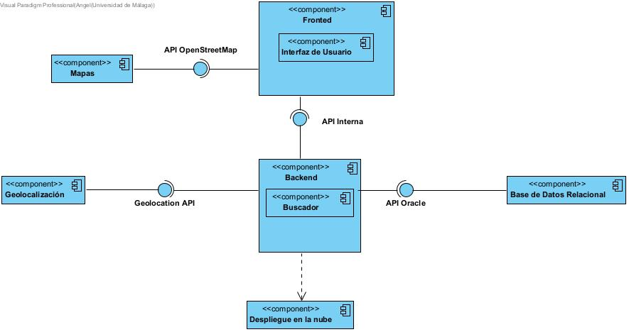
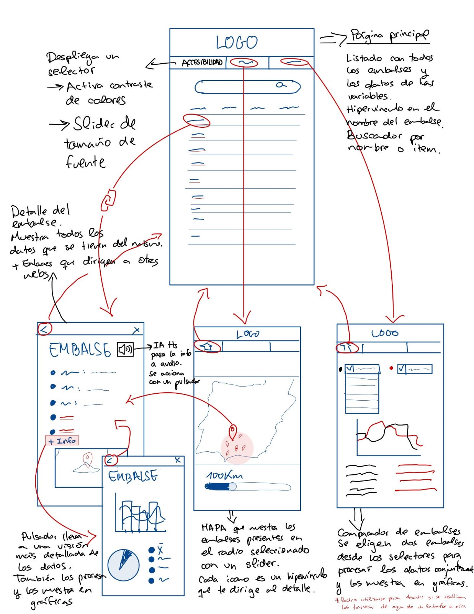
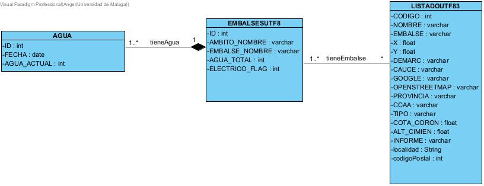

# Malackathon App

> **Nota**: Hay algunas características del código que se dejaron preparadas en un esqueleto inicial de la aplicación y
> que finalmente ni se usaron ni (por cuestiones de tiempo) se retiraron. Los scripts SQL para migración de base de
> datos
> y las clases relacionadas con la entidad `Contact` son ejemplos de esto.

Deploy: //http://143.47.57.2

# Resumen de tecnologías y arquitectura

Diagrama de componentes: Diagrama inicial


## Backend

- Esta escrita en Python con Flask como framework web.
- Utiliza un sistema de plantillas HTML renderizadas con Jinja2 para construir y servir las vistas.
- La aplicación está implementada con una arquitectura por capas, inspirada por la arquitectura hexagonal para que sea
  fácil de escalar y acoplar a diferentes puertos (bases de datos, controladores, APIs externas...)

## Frontend

- HTML renderizado desde el propio *backend* con JavaScript embedido.
- Leaflet para el renderizado de mapas en el cliente.
- Pico.css para el estilo.

### UI

Navegación: Propuesta inicial



## Datos

El acceso a datos se realiza directamente sobre un fichero SQLite de 38MB cargado en el servidor con los *datasets*
preprocesados e importados.

Diagrama relacional: Propuesta inicial


# Ficheros y directorios

- `run.sh`. Script maestro para el mantenimiento y lanzamiento de la aplicación. Ejecutar `./run.sh -h` para ver un
  mensaje de ayuda.
- `configuration.xxx.yml`. Configuración en YAML de los entornos de la aplicación.
- `requirements.txt`. Fichero de las dependencias de python.
- `app`. Módulo python de la aplicación.
    - `ddbb`. **Capa de datos** Submódulo con los componentes de conexión a base de datos.
        - `migration`. Submódulo con los los scripts de migracioń.
    - `usecase`. **Capa de aplicación**. Submódulo con las funciones de los casos de uso de la aplicación.
    - `domain`. **Capa de dominio**. Submódulo con las clases de dominio (entidades).
    - `job`. **Puerto de saliad**. Submódulo para definir las tareas periódicas de la aplicación.
    - `templates`. **UI** Directorio con las plantillas HTML.
    - `controller.py`. **Puerto de salida** Controlador HTTP para mapear URLs de la API a los casos de uso.
    - `__init__.py`. Script de inicialización del módulo principal (funciones de carga de configuración).
    - `__main__.py`. Ejecutable principal.

## Guía de desarrollo

Llamaremos **funcionalidad** a las cosas que puede hacer el usuario con nuestra aplicación web. Estas funcionalidades se
implementan como funciones (o métodos) Python.

### ¿Cómo crear una nueva funcionalidad?

1. Crear un nuevo *script* en el submódulo `usecase` si no se quiere usar uno existente.
1. Añadir una función (o método) que implemente la lógica de la funcionalidad, usando los submódulos de la aplicación (
   como `db` para el acceso a datos) y otras librerías python para sus distintas necesidades.

`app/usecase/mifuncionalidad.py`

```python
def mi_funcionalidad():
    # aquí mi implementación
    return mi_resultado
```

### ¿Cómo ejecutar periódicamente una funcionalidad?

1. Crear un nuevo `script` en el submódulo `job` si no se quiere usar uno existente.
1. Añadir un método anotado con `@app.job.job` (o sólo `@job` si el fichero usa `from . import job`).
1. En el método recién creado, llamar a la funcionalidad en cuestión.

`app/job/mijob.py`

```python
from . import job
from app.usecase.mifuncionalidad import mi_funcionalidad


@job(trigger='interval', minutes=5)
def every_five_minutes_my_funcionality():
    mi_funcionalidad()
```

### ¿Cómo exponer una funcionalidad en la API?

1. Decidir la URL que se va a asociar en la API con el método que implementa la funcionalidad. Por ejemplo, asociemos la
   URL `/foo/bar` con la función `mi_funcionalidad`.
1. Dentro de la función `setup` del fichero `controller.py`, se añade una nueva función:
    - Debe estar anotada con uno de estos cuatro decoradores:
        - `@app.get("/foo/bar")` si es para leer datos.
        - `@app.post("/foo/bar")` si es para crear datos o simplemente ejecutar una operación.
        - `@app.put("/foo/bar")` si es para modificar datos.
        - `@app.delete("/foo/bar")` si es para eliminar datos.
1. Llamar la funcionalidad desde esta función recién creada.
    - Si se quieren devolver datos en formato JSON, la llamada a la funcionalidad debe estar envuelta
      en `flask.jsonify`.
    - Si se quiere devolver una vista HTML, debe usarse `flask.render_template`.

`app/controller.py`

```python
from app.usecase.mifuncionalidad import mi_funcionalidad


# otros imports...

def setup(app: Flask):
    # otras URLs...

    @app.get("/foo/bar")
    def llamar_mi_funcionalidad():
        return flask.jsonify(
            mi_funcionalidad()
        )

```

### ¿Cómo crear una nueva entidad?

Las entidades conforman nuestro modelo de datos. Por eso tienen su correspondencia con una tabla en base de datos para
almacenarlas y una clase en Python para manipularlas desde el código.

1. Creamos la clase en un nuevo script del submodulo `domain`. La anotamos como una clase de datos para que implemente
   algunas funciones por defecto.

   `app/domain/mientidad.py`
    ```python
    from dataclasses import dataclass

    @dataclass
    class MiEntidad:
      id: int
      valor1: int
      valor2: str
    ```


1. Si se trata de una entidad que podremos guardar en base de datos:
    1. Hay que crear un nuevo *script* SQL en el submódulo `db.migration` con el número de secuencia que le corresponda.
       En este *script*, se escribirá el comando para la creación de la nueva tabla en base de datos.
       `VXXX_my_entity_table.sql`
        ```sql
        CREATE TABLE mi_entidad (
            id INTEGER PRIMARY KEY,
            valor1 INTEGER NOT NULL,
            valor2 VARCHAR NOT NULL
        );
        ```
    1. Crear un nuevo repositorio para la interacción entre la tabla y la entidad (implementar las funciones CRUD). Para
       un ejemplo, ver [`contactrepository.py`](app/db/contactrepository.py).
